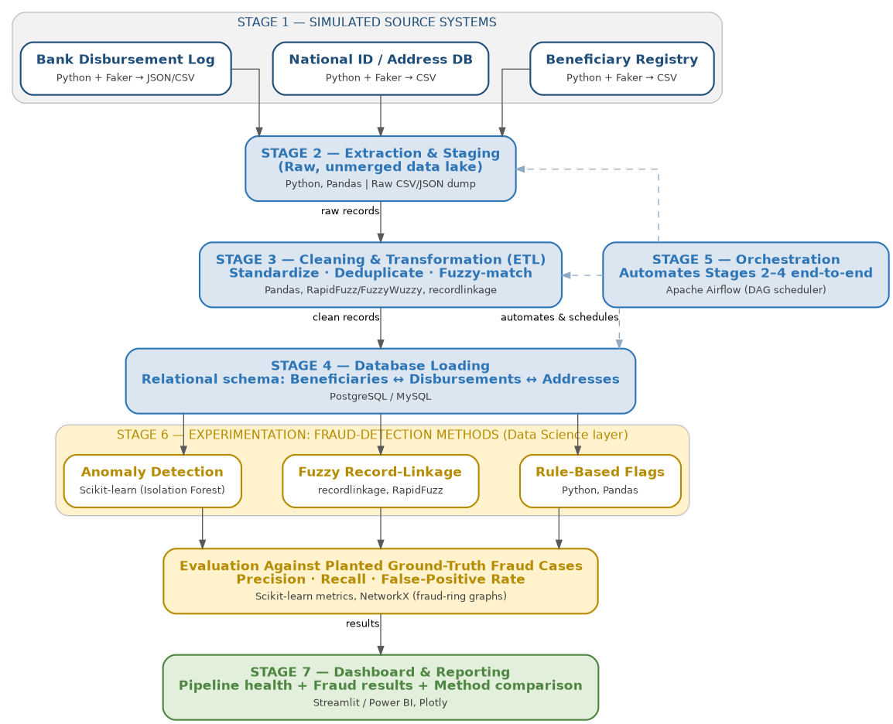

# Multi-Source Data Pipeline & Fraud Detection System for Public Welfare Disbursement

Detecting **"ghost beneficiaries"** in government welfare programs using an end-to-end
data engineering pipeline, with a data science experimentation layer for fraud detection.

> Final Data Science project — Course Submission (Affiliated with IBM certification program).

---

## Problem Statement

Welfare programs (cash transfers, pensions, disaster relief) commonly lose a significant
share of their budget to **ghost beneficiaries** — fake or duplicated identities created to
siphon off funds meant for genuinely vulnerable people. This happens because welfare data is
scattered across disconnected systems (registration forms, national ID records, bank logs)
that are rarely cross-checked properly.

This project builds a pipeline that ingests messy, multi-source welfare data, cleans and
consolidates it, and then experiments with multiple fraud-detection techniques to flag
suspicious entries — before the money is disbursed.

---

## Architecture



The pipeline has three layers:
- **Data Engineering (blue):** extraction, cleaning, database loading, orchestration
- **Data Science (gold):** rule-based flags, fuzzy record-linkage, anomaly detection, evaluation
- **Presentation (green):** interactive dashboard

---

## Tech Stack

| Layer | Tools |
|---|---|
| Data Generation | Python, Faker |
| Data Cleaning / Transformation | Pandas, RapidFuzz, recordlinkage |
| Database | PostgreSQL |
| Orchestration | Apache Airflow |
| Fraud Detection | Scikit-learn (Isolation Forest), NetworkX |
| Dashboard | Streamlit, Plotly |
| Version Control | Git & GitHub |

---

## Project Structure

```
welfare-fraud-detection/
├── data/
│   ├── raw/          # untouched simulated source files
│   ├── staging/      # data after extraction/staging
│   └── clean/        # cleaned & deduplicated data
├── src/
│   ├── data_generation/   # Faker scripts for the 3 sources
│   ├── etl/               # cleaning, transformation, loading scripts
│   ├── database/          # schema.sql, DB connection helpers
│   ├── fraud_detection/   # rule-based, fuzzy-linkage, anomaly model scripts
│   └── dashboard/         # Streamlit app
├── notebooks/         # exploratory Jupyter notebooks
├── airflow/dags/      # DAG definitions
├── tests/
├── docs/              # proposal, diagram, progress log, final report
├── requirements.txt
└── README.md
```

---

## Setup & Installation (macOS)

```bash
# Clone the repo
git clone https://github.com/YOUR_USERNAME/welfare-fraud-detection-pipeline.git
cd welfare-fraud-detection-pipeline

# Create and activate a virtual environment
python3 -m venv venv
source venv/bin/activate

# Install dependencies
pip install -r requirements.txt

# Start PostgreSQL (if not already running)
brew services start postgresql@15
createdb welfare_fraud_db
psql welfare_fraud_db -f src/database/schema.sql
```

---

## Running the Pipeline

**Step 1 — Generate synthetic source data:**
```bash
python src/data_generation/generate_beneficiaries.py --count 5000 --seed 42
python src/data_generation/generate_national_id.py --seed 42
python src/data_generation/generate_disbursements.py --cycles 6 --seed 42
```

**Step 2 — Run the ETL pipeline:** *(coming next)*
```bash
python src/etl/extract_stage.py
python src/etl/clean_transform.py
python src/etl/load_to_db.py
```

**Step 3 — Run fraud detection experiments:** *(coming later)*
```bash
python src/fraud_detection/rule_based.py
python src/fraud_detection/fuzzy_linkage.py
python src/fraud_detection/anomaly_model.py
python src/fraud_detection/evaluate.py
```

**Step 4 — Launch the dashboard:** *(coming later)*
```bash
streamlit run src/dashboard/app.py
```

---

## Progress Status

- [x] Project proposal & architecture design
- [x] Stage 1 — Synthetic data generation (beneficiaries, national ID records, disbursements)
- [x] Fraud patterns planted (shared-account fraud, orphan disbursements, unmatched identities)
- [ ] Stage 2/3 — Extraction, staging & cleaning (ETL)
- [ ] Stage 4 — Database schema & loading
- [ ] Stage 5 — Orchestration (Airflow)
- [ ] Stage 6 — Fraud detection experiments & evaluation
- [ ] Stage 7 — Dashboard
- [ ] Final report & demo

See [`docs/PROJECT_LOG.md`](docs/PROJECT_LOG.md) for detailed, dated build notes.

---

## Author

Muhammad Hamza

## Contributor
Wasiq Ali