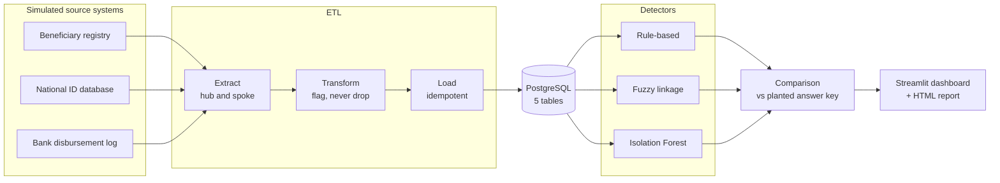
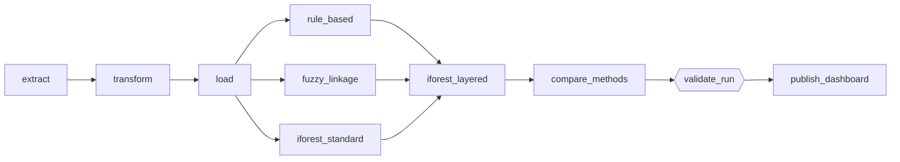

<div align="center">


<br/>


### Multi-Source Data Pipeline & Fraud Detection System for Public Welfare Disbursement

*Three welfare systems that never talk to each other. Three fraud detectors that each see something different.*
*One scoreboard that grades all of them against a known answer key, honestly.*

<br/>

<table>
<tr>
<td align="center" width="180"><h2>10</h2><sub><b>pipeline stages</b><br/>data generation → dashboard</sub></td>
<td align="center" width="180"><h2>3</h2><sub><b>fraud detectors</b><br/>rules · fuzzy linkage · Isolation Forest</sub></td>
<td align="center" width="180"><h2>390</h2><sub><b>planted fraud entities</b><br/>the answer key everything is graded on</sub></td>
<td align="center" width="180"><h2>1</h2><sub><b>Airflow DAG</b><br/>runs it all, then gates the results</sub></td>
</tr>
</table>

**[Results](#results) · [Architecture](#architecture) · [Fraud patterns](#patterns) · [Detectors](#detectors) · [Dashboard](#dashboard) · [Quick start](#quickstart) · [Limitations](#limitations) · [Project log](docs/PROJECT_LOG.md)**

</div>

<br/>

> *Final Data Science project, course submission (affiliated with the IBM certification program).*

---

<a id="problem"></a>
## 🎯 The problem

Welfare programs (cash transfers, pensions, disaster relief) routinely lose a meaningful share of their budget to
**ghost beneficiaries**: fake or duplicated identities created to siphon off money meant for genuinely vulnerable
people. It keeps happening because the evidence is scattered across disconnected systems (the registration
registry, the national ID database, the bank's payment log) that are rarely cross-checked.

This project builds the missing layer. It ingests messy multi-source welfare data, cleans and consolidates it
**without ever destroying evidence**, loads it into PostgreSQL, and then runs three very different fraud-detection
techniques over it, scoring each one against a planted ground truth so the comparison is fair and measurable.

> [!NOTE]
> Real welfare, national ID and bank data is sensitive PII and is never public. So the data here is **synthetic**
> (Python + Faker, Pakistani ID and phone formats). That is a feature as well as a constraint: it lets us plant fraud
> we *know about*, which is the only way to compute real precision and recall.

---

<a id="results"></a>
## 🏆 Results

Every detector is graded against the same answer key (25 orphan payments, 300 shared-account victims, 40 duplicate
identities, 25 behavioural anomalies) on the current dataset of 5,090 beneficiary rows, 18,844 disbursement rows
and 6,040 national ID rows.

| Method | What it hunts | Flagged | Planted found (recall) | Precision |
|---|---|---:|---|---:|
| 📏 **Rule-based** (2 validated rules) | Orphan payments, shared bank accounts | 375 | **325 / 325** · 100% | 100% ¹ |
| 🔗 **Fuzzy record linkage** | Duplicate identities | 80 | **40 / 40 pairs** · 100% | 100% ¹ |
| 🌲 **Isolation Forest**, standard | Multivariate behavioural anomalies | 159 | 3 / 25 · 12% | 2% (79% any-fraud ²) |
| 🌲 **Isolation Forest**, layered | Multivariate behavioural anomalies | 139 | **21 / 25 · 84%** | 15% |
| 🧪 *Reference: `n_payments > 6`* | One-line baseline, not a detector | 217 | 25 / 25 · 100% | 12% (192 of 217 are shared-account victims Stage 5 already catches) |
| 🧩 **Ensemble** (rules + fuzzy + layered IF) | Everything | 592 | **386 / 390 · 99.0%** | 80% any-fraud ² |

<sub>¹ Precision credits the genuine counterparts the answer key never lists as culprits (hub-account owners, the original identity behind each duplicate). Against culprits alone, the rule-based figure is 86.7% (325 / 375); the other 50 are hub-account owners.<br/>
² "Any-fraud" precision counts a flag as correct if the entity belongs to <i>any</i> planted pattern. All of the ensemble's precision loss is Isolation Forest's 118 unplanted flags, which are either novel findings or legitimate rare behaviour and cannot be scored either way.</sub>

### Who finds what

Each method owns a different lane. Bars show recall on that pattern; a dash means the method is not designed to target it.

| Planted pattern | Rules | Fuzzy linkage | IF standard | IF layered |
|---|---|---|---|---|
| 👻 Orphan payments (25) | `██████████` 100% | — | — | — |
| 🏦 Shared-account victims (300) | `██████████` 100% | — | `████░░░░░░` 37% | excluded by design |
| 👥 Duplicate identities (40) | — | `██████████` 100% | 11 flagged incidentally | excluded by design |
| 🎭 Behavioural anomalies (25) | — | — | `█░░░░░░░░░` 12% | `████████░░` 84% |

### What the numbers actually say

1. **Rules and fuzzy linkage are exact on planted structure.** Orphan IDs and shared accounts have an unambiguous
   signature, and duplicate identities keep their date of birth by construction. Perfect scores there confirm the
   detectors work, not that real-world fraud is this easy.
2. **Isolation Forest is the only method that finds the behavioural profile without a hand-written rule**, but it is
   precise on about 1 in 6.6 flags. Its standard run was swamped by shared-account victims (111 of its 159 flags), which are
   *more* extreme than the planted anomalies. **Layered mode**, which trains only on beneficiaries Stages 5 and 6 have not
   already flagged, lifted recall from 12% to 84%.
3. **A one-line baseline ties it.** `n_payments > 6` catches all 25, because the anomalies were planted with a deterministic
   separator (7 payments, versus a legitimate maximum of 6). This experiment shows Isolation Forest *works without being told
   where to look*, not that it beats a rule.

---

<a id="architecture"></a>
## 🏗️ Architecture


The pipeline has three layers:

- **Data Engineering (blue):** extraction, cleaning, database loading, orchestration
- **Data Science (gold):** rule-based flags, fuzzy record linkage, anomaly detection, comparative evaluation
- **Presentation (green):** interactive dashboard and auto-generated report



### Orchestration: one Airflow DAG, one quality gate

The DAG `welfare_fraud_pipeline` runs in Docker (Airflow 2.10.5, CeleryExecutor) on a daily schedule at 21:00 Asia/Karachi.
Layered Isolation Forest waits for the other two detectors because it excludes whatever they flagged. The last two
tasks are the safety net: `validate_run` fails the run if a validated detector regresses on the planted key, and only then
does `publish_dashboard` refresh what the dashboard shows.



---

<a id="patterns"></a>
## 🕵️ The fraud patterns we planted

Four patterns, each with a different signature, and an answer key logged separately in `data/ground_truth_fraud_ids.csv`
that the cleaning and detection code **never reads**. Only the evaluators do.

| | Pattern | The story | Planted | Hunted by |
|---|---|---|---:|---|
| 👻 | **Orphan disbursement** | Money paid to a `beneficiary_id` that exists nowhere in the registry | 25 | Rule-based |
| 🏦 | **Shared account** | Several registered identities funnel payments into one real bank account | 300 victims | Rule-based |
| 👥 | **Duplicate identity** | The same person registered twice: typo in the name, reworded address, same date of birth, fabricated CNIC and bank account | 40 pairs | Fuzzy linkage |
| 🎭 | **Multivariate anomaly** | A genuine, low-income beneficiary whose payments are jointly odd: an extra payment, and amounts nudged to the top of the normal range | 25 | Isolation Forest |

On top of that, `inject_messiness.py` deliberately degrades the raw files the way years of manual entry would: missing values,
mixed date formats, currency strings like `Rs. 10,000`, negative and extreme amounts, inconsistent labels (`Actve`, `M` vs
`Male`), stray whitespace and casing, and fully duplicated rows. Identifier columns and planted fraud are protected from it.

---

<a id="detectors"></a>
## 🔬 The three detectors

<details open>
<summary><b>📏 Stage 5 · Rule-based baseline</b> &nbsp;·&nbsp; six rules, two of them validated</summary>

<br/>

One function per rule, reading from Postgres into pandas and bulk-writing to `fraud_signals` with a `run_id`.

| Rule | Fires when | Status |
|---|---|---|
| `orphaned_disbursement` | A payment references a `beneficiary_id` absent from the registry | ✅ Validated · 25 / 25 |
| `shared_bank_account` | More than one *distinct* beneficiary is paid into the same account | ✅ Validated · 300 / 300 |
| `duplicate_cycle_payment` | Same beneficiary paid twice in one cycle | Heuristic · 2,009 flagged |
| `payment_to_inactive_beneficiary` | Payment made while status is Inactive or Suspended | Heuristic · 596 flagged |
| `cnic_mismatch` | Registry CNIC differs from the linked national ID number | Heuristic · 326 flagged |
| `duplicate_cnic_multiple_identities` | Same CNIC claimed by several beneficiary IDs | Heuristic · 0 flagged |

`duplicate_cycle_payment` overlaps `shared_bank_account` on 50.8% of its signals: it largely re-detects the same fraud from a
different angle. The two are **not counted as independent evidence** anywhere downstream.

</details>

<details open>
<summary><b>🔗 Stage 6 · Fuzzy record linkage</b> &nbsp;·&nbsp; duplicate-identity ghosts</summary>

<br/>

Self-linkage of the beneficiary table: block on exact date of birth (547 candidate pairs instead of over 12 million), score
`full_name` (weight 0.6) and `address_line` (0.4) with RapidFuzz `token_sort_ratio` after stripping common honorifics and
address boilerplate, and choose the flagging threshold by sweeping 0.50–0.99 for the best F1 against the answer key.

- **Result:** 40 / 40 planted pairs found, threshold 0.55, precision = recall = F1 = 1.0.
- **Separation:** true-pair scores run 0.576–0.993 (median 0.961); the best non-match scores 0.540.
- **Without stopword stripping**, true pairs and unrelated same-birthday pairs overlapped heavily. Shared boilerplate tokens
  ("Muhammad", "House", "Street") were doing the matching.

</details>

<details open>
<summary><b>🌲 Stage 7 · Isolation Forest</b> &nbsp;·&nbsp; unsupervised, multivariate</summary>

<br/>

One row per beneficiary with payment count, mean amount, total received, income and amount-to-income ratio. No rules, and
no ground truth, are ever shown to the model (contamination 0.05, 300 trees, seed 42).

- **Standard mode** scores everyone. Shared-account victims (paid 9–12 times) use up the flagging budget: 3 / 25 anomalies found.
- **Layered mode** (`--layered`) first excludes the 411 beneficiaries already flagged by Stage 5 / 6. Nothing is deleted from the
  database. Result: 21 / 25 at 5% flagged, 25 / 25 at 10%, ROC-AUC 0.972.
- The evaluation reports a contamination sweep, ROC-AUC and average precision, and a breakdown of everything the model flagged,
  because "unusual" is not the same as "the one pattern we planted".

</details>

---

<a id="dashboard"></a>
## 📊 Dashboard & auto-generated report

A Streamlit app that explains itself in plain language, so it can be presented without a script. It reads a **published
snapshot** written by the last Airflow task, not live Postgres, so what you demo is exactly what passed the quality gate.

| Page | What it answers |
|---|---|
| **Start here** | What is this system and how do I read it? |
| **Overview** | Headline numbers for the latest validated run |
| **Method comparison** | Who catches what: the coverage heatmap, overlap and unique catches |
| **Investigation queue** | Which beneficiaries deserve a human look first? |
| **Fraud explorer** | Explore flagged entities and the signals behind them |
| **Report** | The full narrative report, in-app |
| **Glossary** | Plain-language definitions of every term used |

The investigation queue ranks by the **number of distinct evidence families** that flagged someone (validated families first,
then all families, then highest score), not by summed scores, precisely because `duplicate_cycle_payment` and
`shared_bank_account` are not independent. Every run also writes a self-contained HTML report
(`data/reports/fraud_report_latest.html`) built from the same snapshot, with numbers computed from the data and template-based
explanations.

---

<a id="principles"></a>
## 🧭 Design principles

These are the invariants every stage respects. Each one exists because breaking it would quietly destroy fraud signal.

| Principle | Why it matters |
|---|---|
| **Flag, never drop** | Suspicious, broken or incomplete rows are kept and flagged. Deleting them deletes the evidence. |
| **No foreign keys between core tables** | Orphaned disbursements and CNIC mismatches *are* the fraud. Referential integrity would make them impossible to load. |
| **Surrogate `row_id`, not business IDs, as the row key** | Messy data contains legitimate full-row duplicates that share a `beneficiary_id`. Only `row_id` is unique per physical row. |
| **Hub and spoke in Extract and Load** | A broken beneficiary file halts the run (`FAILED`). A broken national ID or disbursement file degrades it to `PARTIAL` and carries on. |
| **The answer key is sacred** | Detection code never reads it. Every metric is measured against it, and only the evaluators touch it. |
| **Every run is traceable** | Each detection run writes to shared result tables with a `run_id`, method, signal name, score and timestamp, so methods are comparable side by side. |
| **Data-quality flags and fraud flags live in separate columns** | "This date failed to parse" and "this account is shared" are different claims and are never conflated. |
| **Idempotent loading** | The loader truncates and reloads, so the database is always reproducible from the cleaned files. Detectors re-run after every load. |

---

<a id="stack"></a>
## 🧰 Tech stack

| Layer | Tools |
|---|---|
| Data generation | Python, Faker |
| Cleaning and transformation | pandas (nullable `Float64`), RapidFuzz, recordlinkage |
| Database | PostgreSQL 15, psycopg2 (`execute_values` bulk writes), python-dotenv |
| Fraud detection | SQL and pandas rules, RapidFuzz + recordlinkage, scikit-learn Isolation Forest |
| Evaluation | Precision / recall / F1, ROC-AUC, coverage matrix, overlap (Jaccard), matplotlib |
| Orchestration | Apache Airflow 2.10.5 on Docker (CeleryExecutor), quality-gate task |
| Dashboard | Streamlit, Plotly, self-contained HTML report |
| Version control | Git and GitHub |

---

<a id="structure"></a>
## 📁 Project structure

```
welfare-fraud-detection-pipeline/
├── airflow/
│   └── dags/welfare_fraud_pipeline.py   # the 10-task DAG (extract → … → publish_dashboard)
├── data/
│   ├── raw/                             # simulated source files, with injected messiness
│   ├── staging/                         # extract output, one file per run_id
│   ├── clean/                           # cleaned tables (timestamped copy + fixed-name "latest")
│   ├── results/                         # comparison CSVs, comparison_report.md, coverage heatmap
│   ├── dashboard/                       # published snapshots + latest.json
│   ├── reports/                         # auto-generated HTML reports
│   └── ground_truth_fraud_ids.csv       # the answer key (evaluators only)
├── src/
│   ├── data_generation/                 # generate_* scripts, inject_messiness.py, patch script
│   ├── etl/                             # extract_stage.py, transform_stage.py, loader_stage.py
│   ├── database/                        # schema.sql, config.py, connection.py
│   ├── fraud_detection/                 # rule_based, fuzzy_record, isolation_forest,
│   │                                    #   evaluate_* scripts, compare_methods.py
│   └── dashboard/                       # publish.py, insights.py, report.py, app.py
├── notebooks/                           # exploratory Jupyter notebooks
├── tests/
├── docs/                                # banner, architecture diagram, PROJECT_LOG.md
├── docker-compose.yaml · Dockerfile · requirements-airflow.txt
├── commands.md                          # every Docker / Airflow command, with explanations
└── requirements.txt
```

---

<a id="quickstart"></a>
## 🚀 Quick start

**Prerequisites:** Python 3, PostgreSQL 15, Docker Desktop (only for the Airflow route).

### 1 · Set up

```bash
git clone https://github.com/YOUR_USERNAME/welfare-fraud-detection-pipeline.git
cd welfare-fraud-detection-pipeline

python3 -m venv venv && source venv/bin/activate
pip install -r requirements.txt

brew services start postgresql@15
createdb welfare_fraud_db
psql welfare_fraud_db -f src/database/schema.sql
```

Create a `.env` in the project root with your Postgres connection settings (see `src/database/config.py` for the
variable names). It is git-ignored and credentials are never hard-coded.

### 2 · Generate the synthetic sources (once)

Stage 1 is deliberately **not** in the DAG: the duplicate-identity generator appends to the raw files and `inject_messiness.py`
rewrites them in place, so re-running it blindly would compound.

```bash
python src/data_generation/generate_beneficiaries.py --count 5000 --seed 42
python src/data_generation/generate_national_id.py --seed 42
python src/data_generation/generate_disbursements.py --cycles 6 --seed 42
python src/data_generation/generate_duplicate_identities.py    # plants 40 duplicate pairs
python src/data_generation/generate_anomalous_profiles.py      # plants 25 behavioural anomalies
python src/data_generation/inject_messiness.py                 # run last
```

### 3 · Run everything

<table>
<tr>
<td width="50%" valign="top">

**Route A · One DAG (recommended)**

```bash
docker compose up airflow-init
docker compose up -d
# UI: http://localhost:8080  (airflow / airflow)

docker compose exec airflow-scheduler \
  airflow dags trigger welfare_fraud_pipeline
```

Extract → Transform → Load → all detectors → comparison → quality gate → dashboard snapshot, in one run.

</td>
<td width="50%" valign="top">

**Route B · Stage by stage**

```bash
python src/etl/transform_stage.py   # runs Extract, then Transform
python -m src.etl.loader_stage

python -m src.fraud_detection.rule_based
python -m src.fraud_detection.fuzzy_record
python -m src.fraud_detection.isolation_forest
python -m src.fraud_detection.isolation_forest --layered

python -m src.fraud_detection.compare_methods --list-runs
python -m src.fraud_detection.compare_methods \
  --if-run-id <uuid> --if-layered-run-id <uuid>
```

</td>
</tr>
</table>

### 4 · Open the dashboard

```bash
python -m src.dashboard.publish --if-layered-run-id <uuid>   # skip if Airflow already published
streamlit run src/dashboard/app.py
```

> [!IMPORTANT]
> **Every loader run truncates and reloads the tables**, and `row_id` changes with it, so all detectors must be re-run afterwards
> (the DAG does this for you). Before a live demo, pause the DAG so a scheduled run cannot reload the data mid-presentation:
> `docker compose exec airflow-scheduler airflow dags pause welfare_fraud_pipeline`

> [!TIP]
> Always pass **both** Isolation Forest run IDs to `compare_methods`. Without them it silently takes the latest run, which may be
> the layered one, and labels it "standard". `--list-runs` prints the IDs. The DAG passes them automatically.

---

<a id="limitations"></a>
## ⚖️ Honest limitations

> [!WARNING]
> **Perfect scores here validate detection of the specific planted patterns. They are not evidence of real-world performance.**

- **Planted, not discovered.** The rule-based and fuzzy results are exact because the fraud was generated with a clean signature.
  Real fraud is messier.
- **The fuzzy margin is thin.** True pairs and the best non-match are separated by 0.036 on the current dataset (0.016 on the first).
  It validates one perturbation style (a character-level typo plus an abbreviation swap), not arbitrary real-world name variation.
- **Isolation Forest is a lead generator, not a verdict.** Layered mode is right on about 1 in 6.6 flags, and its unplanted flags are
  either novel findings or legitimate rare behaviour. Without ground truth they cannot be told apart.
- **The anomaly has a one-line separator.** `n_payments > 6` matches Isolation Forest here because the pattern was planted that way.
- **Four of the six rules are unvalidated heuristics.** They are reported as signal counts, never as precision or recall.
- **Some choices were made after seeing results.** The fuzzy threshold and Isolation Forest's layered mode were tuned against the
  answer key: a small evaluation feedback loop, kept to one structural change and no parameter sweep for the latter.
- **Synthetic, single-region data.** Formats and name conventions are Pakistani; nothing has touched a real registry.

---

<a id="progress"></a>
## ✅ Progress

- [x] Project proposal and architecture design
- [x] **Stage 1** · Synthetic sources and four planted fraud patterns, plus deliberate data messiness
- [x] **Stage 2 / 3** · Extraction, staging and cleaning (hub-and-spoke, flag-not-drop)
- [x] **Stage 4** · PostgreSQL schema and idempotent loader
- [x] **Stage 5** · Rule-based detection, validated on 2 of 6 rules
- [x] **Stage 6** · Fuzzy record linkage for duplicate identities, validated
- [x] **Stage 7** · Isolation Forest for multivariate anomalies, standard and layered
- [x] **Stage 8** · Comparative evaluation of all three methods against the answer key
- [x] **Stage 9** · Airflow orchestration in Docker, with a regression quality gate
- [x] **Stage 10** · Streamlit dashboard and auto-generated report
- [ ] Final report and live demo

📖 The full build history, every bug found and every decision (with the reasoning behind it) lives in
[`docs/PROJECT_LOG.md`](docs/PROJECT_LOG.md). Docker and Airflow commands are in [`commands.md`](commands.md).

---

<div align="center">

### Author

**Muhammad Hamza Tahir**

### Contributor

**Wasiq Ali**

<br/>

<sub>Built to catch ghosts, and to be honest about how well it does.</sub>

</div>