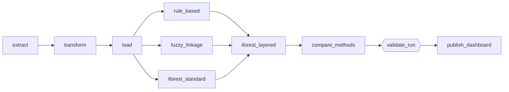

<div align="center">


# 📓 Project Log

**Multi-Source Data Pipeline & Fraud Detection System for Public Welfare Disbursement**

*Every build decision, every bug, every number, and the reasoning behind each one.*

</div>

<br/>

This document tracks what was completed at each stage and **why**, kept updated as the project progressed.
It doubles as the raw material for the final report. The [README](../README.md) is the polished front door;
this is the engine room.

**Contents**
[Status](#status) · [Key numbers](#numbers) · [Stage 1](#stage-1) · [Stage 2/3](#stage-23) · [Stage 4](#stage-4) ·
[Stage 5](#stage-5) · [Stage 6](#stage-6) · [Stage 7](#stage-7) · [Stage 8](#stage-8) · [Stage 9](#stage-9) ·
[Stage 10](#stage-10) · [Bug register](#bugs) · [Limitations](#limitations) · [Open questions](#open)

---

<a id="status"></a>
## 🗺️ Status at a glance

*Updated 2026-09-20*

| Stage | What | Status | Done |
|---|---|---|---|
| 1 | Simulated source systems + planted fraud patterns | ✅ Complete (extended in Stages 6 and 7) | |
| 2/3 | Extract, staging, cleaning | ✅ Complete | |
| 4 | PostgreSQL schema and loader | ✅ Complete (loader made idempotent) | |
| 5 | Rule-based detection | ✅ Complete, validated on 2 of 6 rules | 2026-09-14 |
| 6 | Fuzzy record linkage (duplicate identities) | ✅ Complete, validated | 2026-09-15 |
| 7 | Isolation Forest (multivariate anomalies) | ✅ Complete, validated with limitations | 2026-09-19 |
| 8 | Comparative evaluation of the three methods | ✅ Complete | 2026-09-20 |
| 9 | Orchestration (Airflow in Docker) | ✅ Complete | 2026-09-20 |
| 10 | Dashboard and auto-generated report | ✅ Complete | 2026-09-20 |

`██████████` **10 / 10 stages complete.** Remaining: final report and live demo.

> [!NOTE]
> **Numbering:** the original plan labelled orchestration, experiments and the dashboard as Stages 5–7. Rule-based detection,
> fuzzy linkage and Isolation Forest are now Stages 5–7, so those three items moved to Stages 8–10.

> [!IMPORTANT]
> **Dataset versions:** the Stage 1–4 entries below were written against the **first dataset** (~10,100 beneficiaries,
> ~38,846 disbursements). For the Stage 6–7 work the data was regenerated smaller, and the **current dataset** is
> 5,090 beneficiary rows, 18,844 disbursement rows and 6,040 national ID rows, with a ground-truth answer key of **390 entries**
> (25 `orphan_disbursement`, 300 `shared_account`, 40 `duplicate_identity`, 25 `multivariate_anomaly`).
> Every number below is labelled with the dataset it came from.

---

<a id="numbers"></a>
## 🔢 Key numbers (current dataset)

| Detector | Flagged | Planted found | Precision |
|---|---:|---|---:|
| Rules · `orphaned_disbursement` + `shared_bank_account` | 375 | 325 / 325 · recall 1.00 | 1.00 (0.867 against culprits alone) |
| Fuzzy linkage · duplicate identities | 80 (40 pairs) | 40 / 40 pairs · recall 1.00 | 1.00 |
| Isolation Forest · standard | 159 | 3 / 25 · recall 0.12 | 0.02 (0.792 any-fraud) |
| Isolation Forest · layered | 139 | 21 / 25 · recall 0.84 | 0.151 |
| Reference · `n_payments > 6` | 217 | 25 / 25 · recall 1.00 | 0.115 |
| **Ensemble** · rules + fuzzy + layered IF | 592 | 386 / 390 · core recall 0.990 | 0.801 any-fraud |

Full definitions of these metrics are in [Stage 8](#stage-8).

---

<a id="stage-1"></a>
## 1️⃣ Stage 1 — Simulated Source Systems (Data Generation)

**Status:** ✅ Complete

### What was built

Three independent synthetic data sources were generated using Python + Faker, simulating how a real welfare program's data is
fragmented across disconnected government systems:

1. **`generate_beneficiaries.py`: Beneficiary Registry**
   - Synthetic beneficiary records with realistic fields: CNIC, name, father/husband name, address, phone, bank account,
     welfare program, registration details (~10,000 in the first dataset, 5,000 base records in the current one).
   - Pakistani-format CNIC (`XXXXX-XXXXXXX-X`) and mobile numbers (`03XX-XXXXXXX`) used for realism.

2. **`generate_national_id.py`: National ID / Address Database**
   - Reads the beneficiary file and generates a *separate* database representing a different government system.
   - Most beneficiaries (90% by default, `--match-rate`) get a matching record, but with realistic data-entry noise:
     typo'd names, mutated CNIC digits, differently formatted addresses, occasional DOB drift.
   - The remainder are deliberately left with **no matching ID record**, simulating identities that don't trace back to a real citizen.
   - Extra "citizen-only" records added (not linked to any beneficiary) to simulate a full national population database.

3. **`generate_disbursements.py`: Bank Disbursement Log**
   - Generates recurring monthly payment records for active beneficiaries.
   - **Fraud pattern #1 — Shared account fraud:** a small number of "hub" bank accounts are deliberately reused across multiple
     different beneficiary IDs, simulating a single fraudster controlling several fake/duplicate identities.
   - **Fraud pattern #2 — Orphan disbursements:** a small number of payments are made to beneficiary IDs that do not exist
     anywhere in the registry at all.
   - All planted fraud cases are logged separately to `data/ground_truth_fraud_ids.csv`, reserved strictly for evaluation, never
     used by the cleaning or detection code itself.

4. **`inject_messiness.py`: realistic data-quality damage**
   Missing values, mixed date formats, currency strings, negative and extreme amounts, inconsistent labels, stray whitespace and
   casing, and fully duplicated rows. Identifier columns are never touched, and planted-fraud rows are protected from row duplication.

### Key design decisions

- **Why synthetic data (Faker) instead of real or scraped data:** real welfare, national ID and bank data is sensitive PII that is
  never publicly available. Synthetic data also allows planting a known ground truth, which is required to measure precision and
  recall of the fraud-detection methods later, something impossible with real, unlabeled data.
- **Why CSV files for Stage 1 instead of writing directly to a database:** mirrors how real government data actually arrives, as raw
  exports and dumps, before an ETL process cleans and loads it. Database loading is deliberately scoped to Stage 4.
- **Reproducibility:** the generators accept a `--seed` argument so the same dataset can be regenerated exactly, which matters for
  consistent grading and demoing.

### Output files produced

`data/raw/beneficiaries.csv` · `data/raw/national_id.csv` · `data/raw/disbursements.csv` · `data/ground_truth_fraud_ids.csv`

### Later extensions (planted patterns added for Stages 6 and 7)

- **`generate_duplicate_identities.py`** plants `duplicate_identity` ground truth (see [Stage 6](#stage-6)).
- **`generate_anomalous_profiles.py`** plants `multivariate_anomaly` ground truth (see [Stage 7](#stage-7)).
- **Run order:** the three base generators → `generate_duplicate_identities.py` → `generate_anomalous_profiles.py` → `inject_messiness.py`.
- Stage 1 is deliberately **not** part of the Airflow DAG (see [Stage 9](#stage-9)): the duplicate-identity generator appends to the
  raw files and `inject_messiness.py` rewrites them in place, so blind re-runs would compound.

---

<a id="stage-23"></a>
## 2️⃣3️⃣ Stage 2/3 — Extraction, Staging & Cleaning (ETL)

**Status:** ✅ Complete

### What was built

**Stage 2 (Extract):** processes the three raw CSVs (beneficiaries, disbursements, national ID records) from `data/raw/` into
`data/staging/`. Implements a **hub-and-spoke failure model**: beneficiaries failing to extract halts the entire run (status
`FAILED`); disbursements or national ID records failing marks the run `PARTIAL` and lets the other source continue. `run_extract()`
returns a structured result dict (status, sources loaded/skipped, run_id) for downstream stages to consume. Verified end to end on the
first dataset (~10,100 beneficiaries, ~38,846 disbursements, ~10,000 national ID records).

**Stage 3 (Transform):** produces three **separately cleaned** DataFrames (not one merged table), written to `data/clean/`.
Locked design decisions:

- **Flag-not-drop policy:** uncleansable or implausible values are never deleted, only flagged, preserving full auditability
  for a fraud-detection context.
- Data-quality flags (`dob_parse_failed`, `income_flag`, …) and fraud-signal flags (`shared_bank_account_flag`,
  `orphaned_beneficiary_flag`) kept in **separate columns**, not conflated.
- Dates standardised to ISO `YYYY-MM-DD`; categorical text fields standardised to Title Case.
- PKR domain caps applied: 100,000 (monthly income), 10,000 (disbursement amount). Values outside range are flagged, not dropped.
- **Shared-account fraud signal:** more than 3 disbursements per bank account flagged *(later found to over-fire; see [Stage 5](#stage-5))*.
- **Orphaned disbursement signal:** disbursements referencing a `beneficiary_id` absent from the registry, flagged via anti-join.
- **CNIC vs `national_id_no` mismatches** (559 rows) treated as typo errors: flagged, not auto-corrected, via a left-join comparison
  (`beneficiary_national_id_joined`).
- Each cleaning run writes **two copies** of every output file: a timestamped archive copy (`{source}_cleaned_{run_id}.csv`) and a
  fixed-name copy (`{source}_cleaned.csv`) that downstream stages (loader, and later Airflow) read from. This avoids fragile
  filename-guessing in automation.

### Bugs found and resolved

Invalid imports; inverted truthiness checks; numpy `int64` JSON serialisation failures; path separator inconsistencies; inconsistent
source naming across functions; always-true dict key checks; `pd.NA` silently degrading a column from nullable `Float64` back to
`float64`; currency symbols and commas not stripped from `amount_pkr` before numeric conversion.

> [!WARNING]
> **Later bug, found during Stage 7: "Rs." amounts parsed as tiny numbers.** `strip_currency_symbols` removed the letters of "Rs." but
> left the dot, so `"Rs. 10,000"` became `.10000` and was parsed as 0.1 (likewise 0.5, 0.6, 0.75, 0.8). About 8% of `amount_pkr_clean`
> values (1,483 of 18,536 rows in the cleaned file at the time) were wrong. It was not caught earlier because none of the Stage 5/6 rules
> use payment amounts. Fixed in `strip_currency_symbols`. Confirmed after the ETL re-run: the Stage 7 script, which raises a warning for
> any amount under 1,000, printed no warning.

### Output files produced

- `data/clean/beneficiaries_cleaned_{run_id}.csv` + `beneficiaries_cleaned.csv`
- `data/clean/national_id_cleaned_{run_id}.csv` + `national_id_cleaned.csv`
- `data/clean/disbursements_cleaned_{run_id}.csv` + `disbursements_cleaned.csv`
- `data/clean/beneficiary_national_id_joined_{run_id}.csv` (CNIC-mismatch reference join: a debug/audit artifact, not a source of truth for Stage 6)

---

<a id="stage-4"></a>
## 4️⃣ Stage 4 — Database Schema & Loading

**Status:** ✅ Complete

### What was built

PostgreSQL schema defined in `src/database/schema.sql` with 5 tables: `beneficiaries`, `national_id_records`, `disbursements`,
`record_linkage_matches`, `fraud_signals` (the last two are output tables, populated by the fraud-detection stages).

Loader implemented in `src/etl/loader_stage.py` using `psycopg2` + `execute_values` for batched inserts. Mirrors Stage 2's
hub-and-spoke pattern: beneficiaries failing to load halts the run; `national_id_records` or `disbursements` failing marks the run
`PARTIAL` and lets the other proceed.

### Key design decisions

- **No foreign-key constraints** between `beneficiaries`, `disbursements` and `national_id_records`. Orphaned disbursements and CNIC
  mismatches are fraud *signals* to detect, not integrity errors to prevent. An FK constraint would make it structurally impossible
  to load the very fraud patterns Stage 1 planted.
- **Surrogate primary keys** (`row_id BIGSERIAL`) for `beneficiaries` and `disbursements` instead of their natural IDs. Both tables contain
  legitimate full-duplicate rows (`is_duplicate_row` flag: 200 rows in beneficiaries; ~574 duplicate `disbursement_id`s) that a natural-key
  `PRIMARY KEY` would reject on insert. Surrogate keys let every row load while `beneficiary_id` / `disbursement_id` remain plain indexed
  columns for grouping and analysis. `national_id_records` has no duplicates, so `national_id_no` remains a true primary key.
- **Data-quality and fraud flags stored as `TEXT[]`** (native Postgres arrays), not comma-separated strings, enabling direct queries such as
  `'orphaned_beneficiary_flag' = ANY(data_quality_flags)`.
- **Money columns as `NUMERIC(12,2)`**, not float types, to avoid rounding errors in any later fraud-amount aggregation.
- Credentials handled via `.env` + `python-dotenv`, loaded through `src/database/config.py` and `src/database/connection.py`; never
  hard-coded, and `.env` is excluded from git.

### Bugs found and resolved

- Ambiguous-truth-value crash from calling `pd.isna()` on already-converted list values (`data_quality_flags`): fixed by checking
  `isinstance(x, list)` before the NaN check.
- File-read calls were initially outside their per-table `try` blocks, which broke hub/spoke failure isolation for missing spoke source files.
- `sys.path` project-root calculation went up only one directory instead of two, causing `ModuleNotFoundError: No module named 'src'`.
  Resolved by running via `python -m src.etl.loader_stage` from the project root instead of invoking the script directly.

### Verification

Row counts confirmed to match the source CSVs exactly (10,100 beneficiaries, 38,846 disbursements on the first dataset). `data_quality_flags`
confirmed to load as genuine Postgres arrays (e.g. `{income_flag,phone_missing}`), not stringified lists.

### Output

`src/database/schema.sql` · `src/database/config.py` · `src/database/connection.py` · `src/etl/loader_stage.py`

### Later update: the loader is idempotent

Adding new planted patterns meant the raw data had to be regenerated and reloaded. Dropping and recreating the database each time was
rejected. Instead `loader_stage()` now truncates `beneficiaries`, `national_id_records`, `disbursements`, `fraud_signals` and
`record_linkage_matches` (`RESTART IDENTITY`) at the start of every run. `fraud_signals` and `record_linkage_matches` are included because
they key off `row_id`, which changes on any reload.

> [!IMPORTANT]
> **Stages 5, 6 and 7 must be re-run after every loader run.** The Airflow DAG (Stage 9) does this automatically.

---

<a id="stage-5"></a>
## 5️⃣ Stage 5 — Rule-Based Fraud Detection Baseline

**Status:** ✅ Complete, validated on 2 of 6 rules · *2026-09-14*

### What was built

`src/fraud_detection/rule_based.py`: six rule-based fraud detectors (duplicate CNIC across identities, shared bank account, orphaned
disbursement, CNIC mismatch, duplicate-cycle payment, payment to inactive/suspended beneficiaries), each reading from Postgres into pandas,
applying vectorised rule logic, and bulk-writing results to `fraud_signals` via `execute_values`.
Also `src/fraud_detection/evaluate_rule_based.py`, which scores signals against the planted ground truth in
`data/ground_truth_fraud_ids.csv`.

### Bugs found and fixed during evaluation

> [!WARNING]
> **1. `shared_bank_account` was flagging 99.5% of all disbursements.**
> Root cause: the original Stage 3 flag counted *total disbursement rows per account* (>3), which any legitimate beneficiary paid monthly
> across 6 cycles naturally exceeds. Fixed by recomputing the signal in Stage 5 as *distinct `beneficiary_id` count per account* (>1), the actual
> fraud pattern from `plant_shared_account_fraud`. Signal count dropped from 38,664 to 5,874. Decision: keep the old Stage 3 column as
> legacy/unused rather than re-running Stage 3+4, since this is fraud-detection logic and belongs in Stage 5 conceptually.

> [!WARNING]
> **2. `entity_id` used business identifiers instead of the surrogate key.**
> `inject_messiness.py` duplicates full rows (same `disbursement_id` / `beneficiary_id` on both copies), so business IDs aren't guaranteed unique
> per physical row, the same principle already established for `row_id` vs natural keys in Stage 4. Fixed: `entity_id` in `fraud_signals` now always
> stores `row_id` (cast to text). **This supersedes the earlier locked decision** that `entity_id` should use business identifiers.

> [!WARNING]
> **3. `duplicate_cycle_payment` was partly counting messiness artifacts, not fraud.**
> `inject_messiness.py`'s row duplication (~1.5% of rows) creates exact-copy rows sharing the same `disbursement_id`. Fixed by collapsing rows to
> one event per distinct `disbursement_id` before checking for genuine same-cycle duplicates. Signal count dropped from 6,164 to 5,590.

### Validated results, first dataset (ground truth: 25 orphan, 910 shared_account)

| Signal | Precision | Recall | F1 | Notes |
|---|---:|---:|---:|---|
| `orphaned_disbursement` | 1.0000 | 1.0000 | 1.0000 | Exact match, 25/25 |
| `shared_bank_account` | 0.8465 | 1.0000 | 0.9169 | All 165 "FPs" are hub-account owners not logged as victims in the ground truth: effectively 100% precision once accounted for |

### Key finding: `duplicate_cycle_payment` is not an independent signal

Overlap analysis against `shared_bank_account`: 51.4% of duplicate-cycle signals coincide with shared-account signals, and the ~50% split is
structurally expected. Each victim's fraud pair produces one flagged row (hub account) and one unflagged row (their own account). Conclusion:
`duplicate_cycle_payment` mostly re-detects the same shared-account fraud mechanism from a different angle, not a distinct fraud pattern.

> [!IMPORTANT]
> **Decision:** do not treat these two signals as independent evidence when aggregating a combined risk score. Double-counting one underlying case
> would overstate confidence. (This is why the Stage 10 investigation queue ranks by *evidence families*, not summed scores.)

### Unverified rules (no planted ground truth to score against)

`cnic_mismatch` (556 flagged), `payment_to_inactive_beneficiary` (1,824 flagged), `duplicate_cnic_multiple_identities` (0 flagged):
plausible heuristics, but the generators don't plant corresponding ground truth. Reported as unverified heuristic signal counts, never as precision/recall.

### Re-run on the current dataset (after Stage 6–7 data regeneration)

Signal counts: `shared_bank_account` 1,992 · `duplicate_cycle_payment` 2,009 · `payment_to_inactive_beneficiary` 596 · `cnic_mismatch` 326 ·
`orphaned_disbursement` 25 · `duplicate_cnic_multiple_identities` 0.

| Signal | TP / FP / FN | Precision | Recall | F1 | Notes |
|---|---|---:|---:|---:|---|
| `orphaned_disbursement` | 25 / 0 / 0 | 1.0000 | 1.0000 | 1.0000 | Exact match |
| `shared_bank_account` (beneficiary level) | 300 / 50 / 0 | 0.8571 | 1.0000 | 0.9231 | All 50 FPs are hub-account owners not logged as victims in the answer key |

`shared_bank_account` vs `duplicate_cycle_payment`: 1,021 overlapping `row_id`s, 50.8% of the duplicate-cycle signals, Jaccard 0.3426. Consistent
with the earlier finding that they are not independent evidence.

### `fraud_signals` schema decisions (locked)

One `run_id` UUID per execution · `entity_type` is `'beneficiary'` or `'disbursement'` · `entity_id` is the surrogate `row_id` as text ·
fixed severity scores per rule in the range 0.6–0.95 · `method = 'rule_based'` for all Stage 5 output.

---

<a id="stage-6"></a>
## 6️⃣ Stage 6 — Fuzzy Record Linkage: Duplicate-Identity Ghost Beneficiaries

**Status:** ✅ Complete, validated · *2026-09-15*

### What was built

- **`generate_duplicate_identities.py`** (Stage 1 extension): plants 40 `duplicate_identity` pairs. Each duplicate is the same person registered again
  under a new `beneficiary_id`, with a typo in the name, a reworded address, the same date of birth, a fabricated CNIC and bank account, and its own
  disbursement history. Logged to `ground_truth_fraud_ids.csv` (`original_beneficiary_id`, `duplicate_beneficiary_id`, one `run_id` per execution).
- **`src/fraud_detection/fuzzy_record.py`**: self-linkage of the `beneficiaries` table, writing pairs to `record_linkage_matches`.

### Key design decisions

- **Scope:** beneficiaries against beneficiaries, not beneficiaries against `national_id_records`, because the latter would mostly re-detect the
  exact-match `cnic_mismatch` signal.
- **Blocking on exact `date_of_birth_clean`:** planted duplicates keep the DOB unchanged, so no true pair is blocked out, while comparisons drop from
  O(n²) to same-birthday groups (547 candidate pairs on the current dataset).
- **Scoring:** RapidFuzz `token_sort_ratio` on `full_name` (weight 0.6) and `address_line` (0.4), after stripping domain stopwords (honorifics such as
  "Muhammad", "Bibi", "Khan"; address boilerplate such as "House", "Street", "Block"). Without stopword stripping, true pairs and unrelated same-DOB
  pairs overlapped heavily.
- **Threshold tuned by sweep** over 0.50–0.99, maximising F1 against the 40 known pairs: the same validation rigour as Stage 5.
- **`record_linkage_matches.national_id_no` renamed to `matched_record_id`** (`ALTER TABLE`), since the table now holds beneficiary-to-beneficiary
  matches; `match_method = 'fuzzy_duplicate_identity'` disambiguates.
- Exact full-row duplicate artifacts (`is_duplicate_row`) are excluded from the comparison only, not deleted from the database.

### Bugs found and fixed

> [!WARNING]
> **1. Self-matches flooding the results.** Calling `recordlinkage.Index().index(df, df)` treats the inputs as two datasets, so rows matched to themselves
> (score 1.0). Fixed by using the single-argument deduplication form `index(df)`.

> [!WARNING]
> **2. Duplicate identities silently inheriting the original's bank account.** In the generator, the duplicate's disbursement rows were copied from the
> original's rows without overwriting `bank_account_number`, so every duplicate pair was also an unlogged `shared_bank_account` case. This inflated
> Stage 5's false positives (precision fell to 0.6369, with 171 FPs versus 61 explained hub owners; about 80 extra FPs from ~40 pairs × 2 beneficiaries each).
> Fixed in the generator, with `patch_duplicate_identity_accounts.py` correcting the already-generated raw file, followed by a full re-run of Stages 2–6.

### Results (40 planted pairs)

| Dataset | Best threshold | Precision | Recall | F1 | Lowest true-pair score | Highest non-match score | Margin |
|---|---:|---:|---:|---:|---:|---:|---:|
| First run | 0.57 | 1.0 | 1.0 | 1.0 | 0.585 | 0.569 | 0.016 |
| Current dataset | 0.55 | 1.0 | 1.0 | 1.0 | 0.576 | 0.540 | 0.036 |

On the current dataset: 40/40 true pairs found among candidates; true-pair scores min 0.576, median 0.961, max 0.993; non-match scores median 0.323,
90th percentile 0.406, max 0.540; 44 pairs stored (score ≥ 0.50), 40 flagged.

### Limitations

Perfect scores validate detection of the specific planted perturbation (one character-level typo plus an abbreviation swap), not generalisation to
arbitrary real-world name variation. The margin between true pairs and the best non-match is narrow.

---

<a id="stage-7"></a>
## 7️⃣ Stage 7 — Isolation Forest: Multivariate Behavioural Anomalies

**Status:** ✅ Complete, validated with limitations · *2026-09-19*

### Goal

Detect genuinely registered beneficiaries whose payment behaviour is unusual across several features at once, with no rule and no ground truth given to
the model. Deliberately different from Stages 5–6, which target fake or duplicated identities: this direction was chosen specifically to demonstrate
anomaly detection's advantage over rule-based checks (catching combinations no single hard-coded rule would flag) and to avoid re-detecting Stage 5/6 signals.

### What was built

- **`generate_anomalous_profiles.py`** (Stage 1 extension): plants 25 `multivariate_anomaly` profiles. It only edits `disbursements.csv`; identities are
  untouched. Candidates are Active beneficiaries with monthly income ≤ 8,000 who are not in any other planted pattern. Each gets: missing normal-window
  cycles filled, one extra payment in a cycle outside the simulated window (so exactly 7 payments, while legitimate beneficiaries can have at most 6), and
  up to 2 existing payments raised to the top of the normal amount pool (8,000 / 10,000). Answer-key rows: `fraud_type='multivariate_anomaly'`, `beneficiary_id`.
- **`src/fraud_detection/isolation_forest.py`**: unsupervised detector writing to `fraud_signals` (`method='isolation_forest'`,
  `signal_type='multivariate_anomaly'`, score = anomaly score in (0,1), higher = more unusual).
- **`src/fraud_detection/evaluate_isolation_forest.py`**: scores the stored run against the answer key.

### Design decisions

- **Level of analysis:** one row per `beneficiary_id` (lowest `row_id` kept). `fraud_signals.entity_id` = that beneficiary's `row_id`, the same convention as Stages 5–6.
- **Features:** payment count, mean amount, total received, income (median-imputed if missing), amount-to-income (income floored at 1,000 to avoid dividing by zero).
- **Duplicate disbursement rows collapsed first** (same `disbursement_id`, from `inject_messiness.py`), otherwise a legitimate beneficiary with 6 payments plus
  one artifact copy looks like 7 payments.
- **Beneficiaries with no payments are not scored** (1,862 of 5,040); they have no payment behaviour to model.
- **Ground truth is used only in the evaluation script**, never by the detector.
- **Contamination 0.05** as the headline setting, 300 trees, seed 42. Contamination only moves the flagging cut-off, so the evaluation sweeps it without
  refitting. The default was not tuned against the answer key.
- **Layered mode (`--layered`):** excludes beneficiaries already flagged by the verified Stage 5 `shared_bank_account` rule or Stage 6 fuzzy linkage
  (411 of them) from the model's training and scoring population for that run. Nothing is deleted from the database. Uses earlier detectors' output only.
- **Accepted gap:** `generate_anomalous_profiles.py` never edits `beneficiaries.csv`, and, as in Stage 6, `inject_messiness.py`'s missing-value and
  outlier steps are not filtered by `protected_ids` (only row duplication is), so a planted row could in principle be nulled during cleaning.
  Decided not to fix `inject_messiness.py` for this yet.

### Evaluation design

Isolation Forest is unsupervised and finds "unusual", not one specific planted pattern, and other planted fraud is also unusual. The evaluation therefore
reports: precision/recall/F1 against `multivariate_anomaly`; a breakdown of what the flagged set contains (planted anomaly / shared-account victim /
duplicate identity / unlabeled); a contamination sweep; ROC-AUC and average precision; and the population not already covered by Stages 5–6. Unlabeled
flags are either novel findings or legitimate rare behaviour and cannot be scored as either.

### Run 1: single population (3,178 scored beneficiaries, 159 flagged at 5%)

- Against the answer key: TP=3, FP=156, FN=22 (precision 0.0189, recall 0.12, F1 0.0326).
- Flagged set: 3 planted anomalies, 111 shared-account victims, 11 duplicate-identity beneficiaries, 34 unlabeled.
- Recall by flagging depth: 3/25 at 5%, 9/25 at 8%, 13/25 at 10%, 20/25 at 15%.
- Ranking quality: ROC-AUC 0.9003 (whole population), 0.9519 (planted versus ordinary only); average precision 0.1165 there, against 0.0079 for random guessing.
  As a sanity check, refitting with 10 seeds on the exported scores (using "exactly 7 payments" as a stand-in label) gave ROC-AUC 0.941 ± 0.007.
- Independent discovery: without any rules, 37% of shared-account victims (111/300) and 17.5% of scoreable duplicate-identity beneficiaries (11/63) were flagged.
- **Diagnosis:** shared-account victims are paid 9–12 times (their own plus hub payments), so they are more extreme than the planted 7-payment profiles
  and use up the flagging budget. They also stretch the payment-count range the forest splits over, which makes a step from 6 to 7 payments harder to isolate.

### Run 2: layered (2,767 scored beneficiaries, 139 flagged at 5%)

- Against the answer key: TP=21, FP=118, FN=4 (precision 0.1511, recall 0.84, F1 0.2561).
- Recall by flagging depth: 13/25 at 3%, 21/25 at 5%, 23/25 at 8%, 25/25 at 10% (277 flagged, precision 0.09).
- ROC-AUC 0.9719, average precision 0.1847 (random guessing 0.0090).
- Top of the ranking: 1 planted anomaly in the top 10, 3 in the top 25, 6 in the top 50, 16 in the top 100. The planted profiles sit in the top ~5% band, not at the very top.

| | Run 1 (single population) | Run 2 (layered) |
|---|---:|---:|
| Planted found at 5% flagged | 3/25 (12%) | **21/25 (84%)** |
| Planted found at 10% flagged | 13/25 (52%) | **25/25 (100%)** |
| Precision at 5% | 0.019 | **0.151** |
| ROC-AUC (planted vs ordinary) | 0.952 | **0.972** |
| Average precision | 0.117 | **0.185** |

### Reference baseline (not a Stage 7 detector)

A single rule, `n_payments > 6`, flags exactly the 25 planted profiles: precision 1.0, recall 1.0 *(on the planted set alone)*. The planted pattern has a
deterministic single-feature separator. Isolation Forest is never told that feature or ceiling; the baseline shows what an analyst who already knew where
to look would achieve. Both are reported.

### Limitations

- The planted anomaly is separable by one threshold, so this experiment does not show Isolation Forest beating a rule.
- Precision stays low: 118 of 139 flagged at 5% (layered) are unlabeled.
- The layered change was chosen after seeing Run 1's flagged-set breakdown, a small evaluation feedback loop like Stage 6's threshold tuning. It was one
  structural change, with no parameter sweep.
- The `inject_messiness.py` gap described above.
- High scores on planted data do not prove real-world generalisation.

---

<a id="stage-8"></a>
## 8️⃣ Stage 8 — Comparative Evaluation of the Three Methods

**Status:** ✅ Complete · *2026-09-20*

### What was built

`src/fraud_detection/compare_methods.py`: a read-only comparison of every detector against the same answer key. It reads Postgres and
`data/ground_truth_fraud_ids.csv`, and never writes to either.

```bash
python -m src.fraud_detection.compare_methods --list-runs                      # print run IDs
python -m src.fraud_detection.compare_methods --if-run-id <uuid> --if-layered-run-id <uuid>
```

### Design decisions

- **Common unit of comparison: the business `beneficiary_id`** (including fabricated IDs such as `BEN-900000`). Rule-based emits `row_id`s in
  `fraud_signals` (mapped through `beneficiaries` / `disbursements`), fuzzy emits pairs in `record_linkage_matches` (both members count as flagged), and
  Isolation Forest emits beneficiary `row_id`s.
- **The ground truth plays two roles per pattern:**
  - **core:** the planted culprits (orphan fabricated IDs, shared-account victims, duplicate identities, planted anomalies);
  - **involved:** core plus the genuine counterparts never logged as culprits (hub-account owners for shared_account, original beneficiaries for duplicate_identity).
- **Metrics:** recall is measured on **core**; precision on **involved**. `precision_strict` (core only) ties out with the earlier per-stage evaluators, and
  `any_fraud_precision` credits a flag if the entity is part of *any* planted fraud.
- **The four heuristic rules have no ground truth**, so they get counts and `any_fraud_precision` only, never validated metrics.
- **`n_payments > 6` (`baseline:payment_count_gt_6`) is included as a labelled reference row**, not a proposed detector.

### Results (current dataset; answer key = 390 core entities: 25 orphan, 300 shared-account victims, 40 duplicate identities, 25 anomalies)

| Method | Flagged | Result against the key |
|---|---:|---|
| **Rules** (validated 2) | 375 | Recall 1.0 on orphan and shared_account · precision 1.0 |
| **Fuzzy linkage** | 80 | Recall 1.0 on duplicates, 40/40 pairs · precision 1.0 |
| **Isolation Forest, standard** | 159 | Only 3/25 anomalies (recall 0.12); mostly re-detects Stage 5/6 fraud (any-fraud precision 0.792) |
| **Isolation Forest, layered** | 139 | 21/25 anomalies (recall 0.84) · precision 0.151 · no shared-account or duplicate flags |
| *Reference:* `n_payments > 6` | 217 | 25/25 · about 192 of the 217 are shared-account victims Stage 5 already catches |
| **Ensemble** (rules + fuzzy + layered IF) | 592 | Overall core recall **0.990** · any-fraud precision 0.801 (all precision loss is Isolation Forest's 118 unplanted flags) |

### Findings

1. **Each method owns a different lane.** Rules and fuzzy linkage are exact on the patterns with an unambiguous signature; Isolation Forest is the only method that
   finds the behavioural profile without a hand-written rule.
2. **Layering matters more than tuning.** Excluding what Stages 5–6 already flagged turned a 12% recall into 84% with a single structural change.
3. **The ensemble is the strongest reading, and its weak point is honest.** Recall of 0.990 comes with precision paid entirely by Isolation Forest's unlabeled flags.
4. **Signals are not independent evidence.** `shared_bank_account` and `duplicate_cycle_payment` describe the same fraud; combining methods must count evidence families,
   not sum scores (implemented in the Stage 10 queue).

### Outputs (`data/results/`)

`comparison_detector_metrics.csv` · `comparison_coverage_matrix.csv` (recall by pattern × method) · `comparison_unique_catches.csv` ·
`comparison_overlap_jaccard.csv` · `comparison_report.md` · `comparison_coverage_heatmap.png`

> [!WARNING]
> **Pitfall learned:** running `compare_methods` without explicit Isolation Forest run IDs silently uses the *latest* run (which was the layered one) and labels it
> "standard". Always pass both run IDs. The Airflow DAG does this automatically.

---

<a id="stage-9"></a>
## 9️⃣ Stage 9 — Orchestration with Apache Airflow

**Status:** ✅ Complete · *2026-09-20*

### What was built

Airflow 2.10.5 in Docker (the official CeleryExecutor compose, patched by script) in the project root. The DAG `welfare_fraud_pipeline`
(`airflow/dags/welfare_fraud_pipeline.py`) ran end to end successfully. The project's Postgres stays on the Mac host, reached from the containers as
`host.docker.internal`. Every command, with explanations, is in [`commands.md`](../commands.md).

- Custom image `welfare-airflow:2.10.5`, built from `Dockerfile` + `requirements-airflow.txt` (rapidfuzz, recordlinkage, scikit-learn, python-dotenv, matplotlib, `pandas>=2,<3`).
- Project mounted at `/opt/airflow/project`; `PROJECT_ROOT` and `PYTHONPATH` set; `extra_hosts host.docker.internal:host-gateway`.
- `AIRFLOW_PROJ_DIR=./airflow` and `AIRFLOW_UID=50000` in the project `.env`. UI at `localhost:8080` (airflow / airflow).

### DAG design



- **ETL stages run in-process** (run_id and status pass via XCom); **detectors run as `python -m` subprocesses** from the project root.
- **`iforest_layered` waits for all three** upstream detectors, because layered mode excludes what Stage 5 and Stage 6 flagged. Both Isolation Forest run IDs are read from
  `fraud_signals` and handed to `compare_methods`.
- **Schedule** daily 21:00 Asia/Karachi · `catchup` off · `max_active_runs=1` (the loader truncates shared tables) · retries 1 with a 2 min delay · `dagrun_timeout` 2 h.
- **PARTIAL load continues with a warning** (hub-and-spoke) unless `FAIL_ON_PARTIAL_LOAD` is set.
- **Stage 1 data generation is deliberately not in the DAG**, because `generate_duplicate_identities.py` appends and `inject_messiness.py` rewrites in place.

### The `validate_run` quality gate

Fails the run if any required table is empty, if the comparison result files are older than the DAG run, or if a validated detector falls below its regression floor on the
planted key: rule orphan / shared and fuzzy **recall and precision ≥ 0.99**, layered Isolation Forest **recall ≥ 0.60**. These floors are regression guards against a broken
pipeline, **not real-world performance claims**.

### Gotchas worth remembering

> [!CAUTION]
> **Never name a container env var `DB_HOST`.** Airflow's entrypoint reads it to find the Redis broker, so the scheduler and worker looped on "connection refused" and runs stayed
> queued. The container gets `PROJECT_DB_HOST`, and the DAG's `_prepare_env()` copies it into `DB_HOST` at task time. `_run_module` must call `_prepare_env()` *before* copying the
> environment to subprocesses, or the detector tasks fail in about a second with connection refused.

- The DAG folder must be `airflow/dags`. New DAG files are discovered after about 5 minutes (`airflow dags reserialize` forces it); edits to existing DAG files reload within about 30 seconds.
- `docker compose down --volumes` wipes only Airflow's own metadata, never the project data.
- **Every DAG run truncates and reloads the project tables**, so pause the DAG before demoing:
  `docker compose exec airflow-scheduler airflow dags pause welfare_fraud_pipeline`.

---

<a id="stage-10"></a>
## 🔟 Stage 10 — Dashboard & Auto-Generated Report

**Status:** ✅ Complete · *2026-09-20*

### What was built

A Streamlit app, plus a self-contained HTML report, both refreshed automatically by a new Airflow task `publish_dashboard` that runs downstream of `validate_run`. The Airflow run
succeeded with the new task, and the app, report and dashboard were reviewed and are in place.

### Requirements that shaped it

The dashboard had to update automatically whenever an Airflow run passes; the app had to explain itself in plain language so it can be presented without a script; and there had to
be an automatically generated saved report explaining all the results.

### Design decisions

- **The dashboard reads a published snapshot folder, not live Postgres.** A final Airflow task writes it after `validate_run`, so the dashboard only ever shows a run that passed the
  quality gate, and a mid-demo reload of the database cannot change what is on screen.
- **The investigation queue ranks by the number of distinct evidence families flagged, not summed scores:** validated families first, then all families, then highest score.
  `duplicate_cycle_payment` and `shared_bank_account` are not independent evidence, so summing would double-count one case.
- **The report is built from the same snapshot as the dashboard:** self-contained HTML saved in the snapshot folder and in `data/reports/`
  (`fraud_report_<snapshot_id>.html` and `fraud_report_latest.html`). Numbers are computed from the snapshot and the explanatory text is template-based, not AI-generated.

### Code

`src/dashboard/` holds `publish.py`, `insights.py`, `report.py` and `app.py`.

```bash
python -m src.dashboard.publish --if-layered-run-id <uuid>   # writes data/dashboard/<snapshot_id>/, then updates data/dashboard/latest.json
streamlit run src/dashboard/app.py
```

**App pages:** Start here · Overview · Method comparison · Investigation queue · Fraud explorer · Report · Glossary.
`publish_dashboard` gets the layered Isolation Forest `run_id` from XCom; `python -m src.fraud_detection.compare_methods --list-runs` prints run IDs.

### Data sources it reads

- **`fraud_signals`**: `entity_id` = `row_id` as text; `entity_type` `'beneficiary'` or `'disbursement'`; `method`, `signal_type`, `score`, `run_id`, `created_at`. Latest run per method; Isolation
  Forest has two runs (standard and layered), told apart by `run_id`.
- **`record_linkage_matches`**: `beneficiary_id`, `matched_record_id`, `match_method`, `confidence_score`, `is_flagged`. Pairs, not per-beneficiary.
- **`beneficiaries` and `disbursements`**: carry the surrogate `row_id`, which changes on every loader run.
- **Comparison result files** in `data/results/` (see Stage 8). Detector names in `comparison_detector_metrics.csv` include `rule:orphaned_disbursement`, `rule:shared_bank_account`,
  `fuzzy:duplicate_identity` and `iforest:layered` (from the DAG's quality gates).

### Validation

`publish.py` output was checked against the answer key: `case_queue.csv` has **one row per `beneficiary_id`** and contains **25/25** orphan IDs, **300/300** shared-account victims and
**80/80** duplicate-identity IDs.

### Talking points for the presentation

- Rules and fuzzy linkage are perfectly precise on the planted patterns.
- Layered Isolation Forest is the only method that finds the multivariate profile without a hand-written rule, but it is precise about 1 in 6.6 flags.
- A one-line `n_payments > 6` baseline matches it, because the anomalies were planted with a deterministic separator.
- Perfect scores cover planted patterns only.

---

<a id="bugs"></a>
## 🐛 Bug register

Every bug that changed a result or a design decision, in one place.

| Stage | Bug | Root cause | Fix |
|---|---|---|---|
| 3 | `"Rs. 10,000"` parsed as 0.1 (~8% of amounts) | Currency stripping removed the letters but left the dot | Fixed `strip_currency_symbols`; ETL re-run |
| 4 | `pd.isna()` crash on list values | Called on already-converted `data_quality_flags` | Check `isinstance(x, list)` first |
| 4 | `ModuleNotFoundError: No module named 'src'` | `sys.path` went up one directory, not two | Run with `python -m` from the project root |
| 5 | `shared_bank_account` flagged 99.5% of disbursements | Counted rows per account instead of distinct beneficiaries | Recomputed in Stage 5 as distinct beneficiaries per account (>1) |
| 5 | `entity_id` not unique per physical row | Business IDs repeat on messiness-duplicated rows | `entity_id` = surrogate `row_id` |
| 5 | `duplicate_cycle_payment` counting artifacts | Exact-copy rows share a `disbursement_id` | Collapse to one event per `disbursement_id` first |
| 6 | Results flooded with score-1.0 self-matches | `index(df, df)` treats inputs as two datasets | Single-argument `index(df)` deduplication mode |
| 6 | Stage 5 precision fell to 0.637 | Duplicate identities inherited the original's bank account | Generator fix + `patch_duplicate_identity_accounts.py`, then a full re-run |
| 8 | "Standard" Isolation Forest row was actually the layered run | `compare_methods` defaults to the latest run | Always pass both run IDs (the DAG does) |
| 9 | Scheduler and worker looped on "connection refused" | A container env var named `DB_HOST` collides with Airflow's Redis lookup | `PROJECT_DB_HOST`, copied to `DB_HOST` by `_prepare_env()` at task time |
| 9 | Detector tasks failed in ~1 second | `_run_module` copied the environment before `_prepare_env()` ran | Call `_prepare_env()` first |

---

<a id="limitations"></a>
## ⚖️ Consolidated limitations

> [!WARNING]
> **Perfect scores here validate detection of the specific planted patterns. They are not evidence of real-world performance.**

- **Planted, not discovered.** The rule-based and fuzzy results are exact because the fraud was generated with a clean signature.
- **Thin fuzzy margin.** 0.016 on the first dataset, 0.036 on the current one. One perturbation style (a character-level typo plus an abbreviation swap) is validated, not arbitrary name variation.
- **Isolation Forest is a lead generator, not a verdict.** Layered mode is precise on about 1 in 6.6 flags; its unplanted flags are novel findings or legitimate rare behaviour and cannot be told apart without ground truth.
- **Deterministic separator.** The anomalies were planted at exactly 7 payments, so `n_payments > 6` ties Isolation Forest on this dataset.
- **Four of six rules are unvalidated heuristics.** Reported as counts only.
- **Evaluation feedback loops.** The fuzzy threshold was tuned against the key; the layered mode was chosen after seeing the standard run's breakdown (one structural change, no sweep).
- **Known gap.** `inject_messiness.py`'s missing-value and outlier steps are not protected by `protected_ids`, so a planted row could in principle be nulled during cleaning.
- **Synthetic, single-region data.** Nothing has touched a real registry.
- **Quality-gate floors are regression guards**, not real-world claims.

---

<a id="open"></a>
## 📌 Open questions & follow-ups

**Resolved**
- [x] Full Airflow deployment vs a simplified scheduler: full Airflow on Docker was built (Stage 9).

**Before pushing to GitHub**
- [ ] Add `.env` to `.gitignore`, and ignore `airflow/logs/`.
- [ ] Add a host `requirements.txt` (the README's setup step installs from it; `requirements-airflow.txt` covers only the containers).
- [ ] In `extract_stage.py`, change `json.dump(summary, f, indent=2)` to `json.dump(summary, f, indent=2, default=list)`: a latent bug, since the sets in a failed spoke's `validation_result` are not JSON-serialisable.

**Before the demo**
- [ ] Pause the DAG (`docker compose exec airflow-scheduler airflow dags pause welfare_fraud_pipeline`), since every run truncates and reloads the project tables.
- [ ] Add the Roman Urdu explanation layer if the instructor expects it.

**Design and evaluation**
- [ ] Decide which Isolation Forest configuration is the headline in the final report. In practice the Stage 8 ensemble and the Stage 10 dashboard both use layered; confirm, and keep standard as the before/after.
- [ ] Optional: add a residual-baseline row to `compare_methods` (`n_payments > 6` after excluding Stage 5/6 flags), the like-for-like comparison with layered Isolation Forest.
- [ ] NetworkX was in the original stack but is not used anywhere yet. Either add a shared-account graph (e.g. on the dashboard) or keep it out of the claims. The README no longer lists it.
- [ ] Confirm whether a secondary real public dataset should be blended in for validation.
- [ ] `is_duplicate_row` uses `duplicated(keep=False)`, so both copies of a messiness-duplicated beneficiary are flagged, and the fuzzy-linkage stage and the duplicate-CNIC rule then exclude both. Verify against the database and decide whether to keep one copy per `beneficiary_id`.
- [ ] Optionally protect planted rows from `inject_messiness.py`'s missing-value/outlier steps (known gap shared by Stages 6–7).

---

<div align="center">
<sub>Part of the <a href="../README.md">Ghost Beneficiary Detection Pipeline</a> · Muhammad Hamza &amp; Wasiq Ali</sub>
</div>